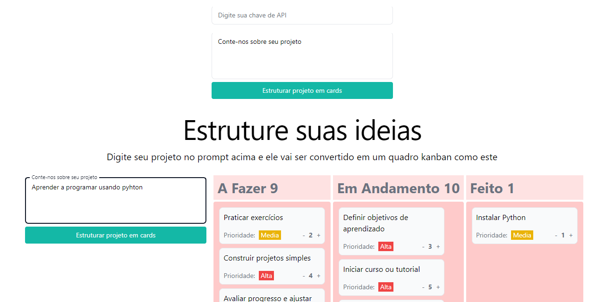
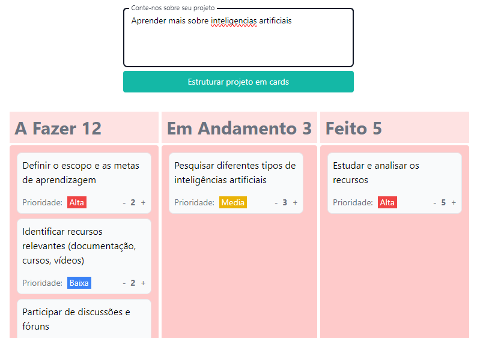

# Convert-prompts-to-cards
 Projeto criado como desafio final da imersão IA da alura, Com o objetivo de estruturar os prompts do usuário em quadros kanban, para que ele tenha controle maior de seus projetos, o objetivo do projeto não é o controle total dos cards apenas demonstrar as capacidades da inteligência artificial, por isso as tarefas não ficam salvas em bancos de dados.

# Imagens do projeto

https://github.com/VitorSVNascimento/Convert-prompts-to-cards/assets/82065313/8b7e4481-a718-4b19-97c8-52bc1a410746

# Como rodar localmente
## Pré requisitos 
- Python versão 3.11.5
- Ter uma chave de API do google gemini

## Como utilizar o projeto
### Supondo que todos os requisitos básicos tenham sido atendidos 
1. Clone ou faça download do projeto
2. Vá até a pasta raiz do projeto
3. Crie o ambiente virtual de sua preferencia. Exemplo

        python -m venv venv
4. Execute o ambiente virtual. Exemplo

        .\venv\Scripts\activate
5. Após entrar no ambiente virtual instale as bibliotecas necessárias a partir do arquivo requirements.txt
        
        pip install -r requirements.txt

6. na raiz do projeto execute o comando 
        
        python ./start.py

7. Acesse o link local do servidor ou cole o endereço abaixo no navegador
        http://127.0.0.1:5000

